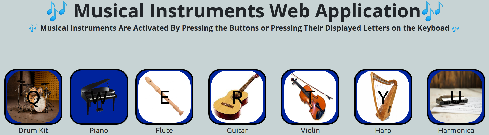

<h1> The Musical Instruments Project </h1> 

This project utilizes HTML, CSS, and JS to create a virtual 
musical instrumentation sounds that activate based on clicking a putting or pressing a specific  key in the keyboard. The project is web/mobile friendly 
 

 The following technologies were used: 

<ul>
<li>HTML</li>
<li>CSS</li>
<li>JS</li>
</ul>

 The UI of the web application is presented below 
 

